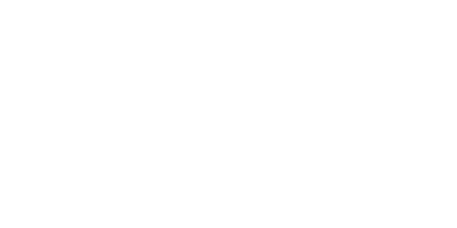

# glslViewer 

 

GlslViewer is a flexible console-base OpenGL Sandbox to display 2D/3D GLSL shaders without the need of an UI. You can definitely make your own UI or wrapper using the Python Module (include) or any other tool that communicates back/forth with glslViewer through the standard POSIX console In/Out or OSC.

Joing [#GlslViewer channel on shader.zone discord](https://shader.zone/) to learn how to use it, share work and get help.

GlslViewer gives support to:

* fragment and vertex shaders on GLSL 
* resolve #include dependencies
* adding/deleting #define keys through console IN commands and OSC
* automatically generated set of defines based on the platform, buffer, render pass, geometry attributes and materials properties.
* passing custom uniforms (float, int, vec2, vec3 and vec4) through console IN or OSC
* Different kinds of Textures (png, bmp, jpg, tga, hdr, gif, mp4, mov, rtc, rtsp, local camera devices and audio textures)
* import of Cubemaps and spherical harmonics (png, jpg, tga, hdr)
* import LST, PLY, OBJ or GLTF files (and their dependencies)
* default vert/frag shaders for 2D shader and 3D material shaders with PBR lighting model
* hot reload of files on changes
* One default light and one default camera
* Interactive commands thought POSIX console IN/OUT or OSC
* different debug modes (histogram, textures, buffers, bounding box, etc)
* shadow maps
* headless rendering
* fullscreen and screensaver mode
* HoloPlay rendering on LookingGlass Display
* image export
* PNG sequence export
* WASM crosscompiling

## Wiki themes

* [Installing](https://github.com/patriciogonzalezvivo/glslViewer/wiki/Installing)
    * [Compile on Linux](https://github.com/patriciogonzalezvivo/glslViewer/wiki/Compile-on-linux)
    * [Compile on MacOS](https://github.com/patriciogonzalezvivo/glslViewer/wiki/Compile-on-MacOS)
    * [Compile on Windows](https://github.com/patriciogonzalezvivo/glslViewer/wiki/Compile-on-Windows)
    * [Compile as WebAssembly](https://github.com/patriciogonzalezvivo/glslViewer/wiki/Compile-as-Emscripten-WebAssembly)

* [Using GlslViewer](https://github.com/patriciogonzalezvivo/glslViewer/wiki/Using-GlslViewer)
    * [Loading a single Fragment shader](https://github.com/patriciogonzalezvivo/glslViewer/wiki/Using-GlslViewer#1-loading-a-single-fragment-shader)
    * [Loading geometry and a vertex shader](https://github.com/patriciogonzalezvivo/glslViewer/wiki/Using-GlslViewer#2-loading-geometry-and-a-vertex-shader)
    * [Load a model and edit the default PBR shader](https://github.com/patriciogonzalezvivo/glslViewer/wiki/Using-GlslViewer#21-load-a-model-and-edit-the-default-pbr-shader)
    * [Loading Textures](https://github.com/patriciogonzalezvivo/glslViewer/wiki/Using-GlslViewer#3-loading-textures)
    * [Audio and video Textures](https://github.com/patriciogonzalezvivo/glslViewer/wiki/Audio-and-Video-Textures)
    * [Other arguments](https://github.com/patriciogonzalezvivo/glslViewer/wiki/Using-GlslViewer#4-other-arguments)
    * [Console IN commands](https://github.com/patriciogonzalezvivo/glslViewer/wiki/Interacting-with-GlslViewer)

* Convention: 
    * [Defines](https://github.com/patriciogonzalezvivo/glslViewer/wiki/GlslViewer-DEFINES)
         * [Platform](https://github.com/patriciogonzalezvivo/glslViewer/wiki/GlslViewer-DEFINES#platform-defines)
         * [Buffers & Render Passes](https://github.com/patriciogonzalezvivo/glslViewer/wiki/GlslViewer-DEFINES#buffers-and-render-passes)
         * [Geometry Attributes](https://github.com/patriciogonzalezvivo/glslViewer/wiki/GlslViewer-DEFINES#geometry-defines)
         * [Materials](https://github.com/patriciogonzalezvivo/glslViewer/wiki/GlslViewer-DEFINES#material-defines)
    * [Uniforms](https://github.com/patriciogonzalezvivo/glslViewer/wiki/GlslViewer-UNIFORMS)

## Author

[Patricio Gonzalez Vivo](https://twitter.com/patriciogv): [github](https://github.com/patriciogonzalezvivo) | [twitter](https://twitter.com/patriciogv) | [instagram](https://www.instagram.com/patriciogonzalezvivo/) | [website](http://patricio.io)

## Acknowledgements

Thanks to:

* [Mihai Sebea](https://twitter.com/mihai_sebea) and [Bertrand Carré](https://twitter.com/bertrandcarre) for making the Windows compile happen

* [Karim Naaki](http://karim.naaji.fr/) lot of concept and code was inspired by this two projects: [fragTool](https://github.com/karimnaaji/fragtool) and [hdreffects](https://github.com/karimnaaji/hdreffects)

* [Doug Moen](https://github.com/doug-moen) he help to add the compatibility to ShaderToy shaders and some RayMarching features were added for his integration with his project: [curv](https://github.com/doug-moen/curv).

* [Wray](https://twitter.com/wraybowling) implement the OSC listener feature, opening GlslViewer to an entire new ways of communicating and interacting with other apps, devices and ecosystems.

* [Yvan Sraka](https://github.com/yvan-sraka) for putting the code in shape and setting it up for TravisCI.

* [Andsz](http://andsz.de/) for Spherical Harmonics code from [Spherical Harmonics Playground](https://github.com/ands/spherical_harmonics_playground/)

* [Syoyo Fujita](syoyo.wordpress.com) for the work on [tinyobjloader v1.0.x](https://github.com/syoyo/tinyobjloader)

* [Morgan McGuire](https://casual-effects.com)'s for the OBJ models on [Computer Graphics Archive](https://casual-effects.com/data)

* [Philip Rideout](http://prideout.net/) and [Romain Guy](http://www.curious-creature.com/) general generosity to share their code and experience

* [Sergei B](https://github.com/bespsm) for adding support for Audio textures

